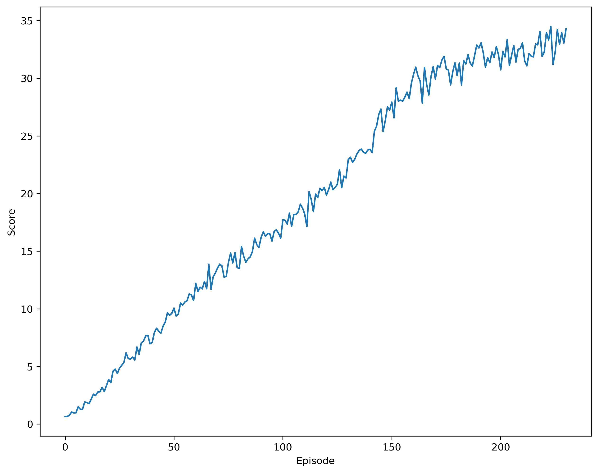

# Environment
In this environment, a double-jointed arm can move to target locations. A reward of +0.1 is provided for each step that the agent's hand is in the goal location. Thus, the goal of your agent is to maintain its position at the target location for as many time steps as possible. There exists 20 identical agents, each with its own copy of the environment.

The observation space consists of 33 variables corresponding to position, rotation, velocity, and angular velocities of the arm. Each action is a vector with four numbers, corresponding to torque applicable to two joints. Every entry in the action vector should be a number between -1 and 1.

The environment is considered solved, when the average (over 100 episodes) of accumulated scores across the 20 agents is at least +30.

The environment used in this project is adopted from Reacher environment of [Unity ML-Agents](https://github.com/Unity-Technologies/ml-agents). To run the environment, user don't need to install the Unity, but download the environment configuration files from [here](https://github.com/udacity/deep-reinforcement-learning/tree/master/p2_continuous-control).

# Dependence

This project is build on Python 3.6. Following dependencies are required:

* unityagents==0.4.0
* torch==1.4.0
* tensorflow==1.7.1
* numpy>=1.11.0

# Instruction

* `Continuous_Control.ipynb`: the driving file to set up the environment and train the agent with PPO with GAE, include:
* `PPO_Agent.py`: define PPO Agent class
* `ActorCriticNetwork.py`: define neural netowrk architecture (both actor and critic) for PPO algorithm

# Results

The plot of average (across all the 20 agents) accumulated rewards is shown as below,

